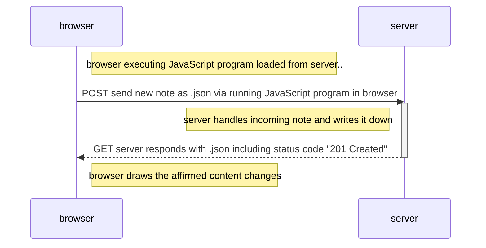

```mermaid
sequenceDiagram
  participant browser
  participant server

  Note right of browser: browser executing JavaScript program loaded from server..
  browser->>server: POST send new note as .json via running JavaScript program in browser
  activate server
  Note left of server: server handles incoming note and writes it down
  server-->>browser: GET server responds with .json including status code "201 Created"
  deactivate server
  Note right of browser: browser draws the affirmed content changes
``` 