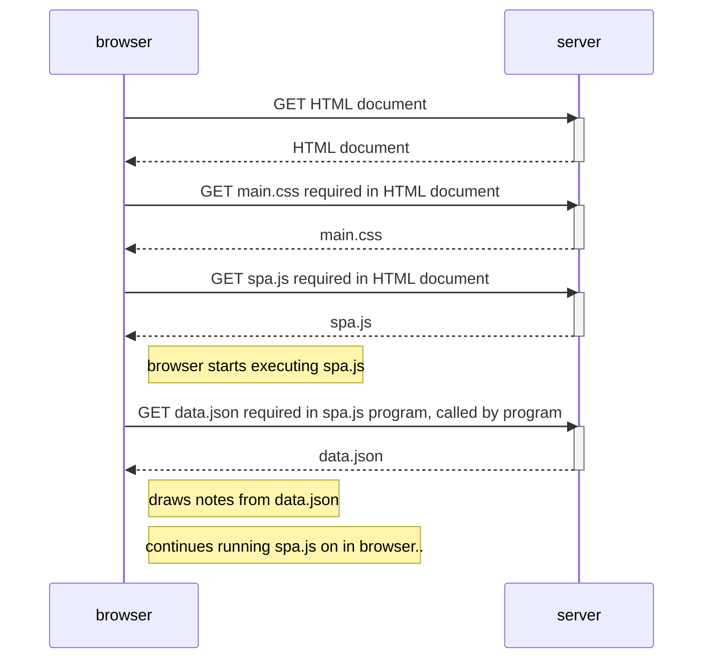

```mermaid
sequenceDiagram
  participant browser
  participant server

  browser->>server: GET HTML document
  activate server
  server-->>browser: HTML document
  deactivate server

  browser->>server: GET main.css required in HTML document
  activate server
  server-->>browser: main.css
  deactivate server

  browser->>server: GET spa.js required in HTML document
  activate server
  server-->>browser: spa.js
  deactivate server
  Note right of browser: browser starts executing spa.js

  browser->>server: GET data.json required in spa.js program, called by program
  activate server
  server-->>browser: data.json
  deactivate server
  Note right of browser: draws notes from data.json
  Note right of browser: continues running spa.js on in browser..
``` 